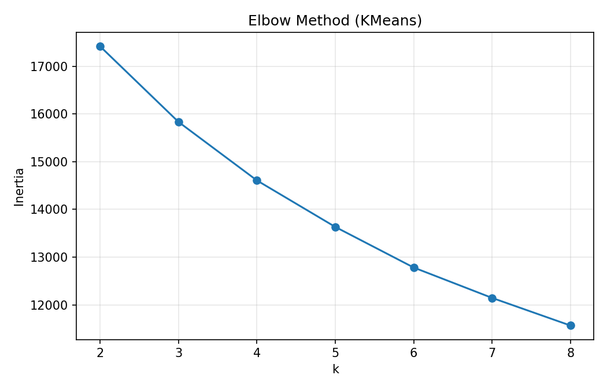
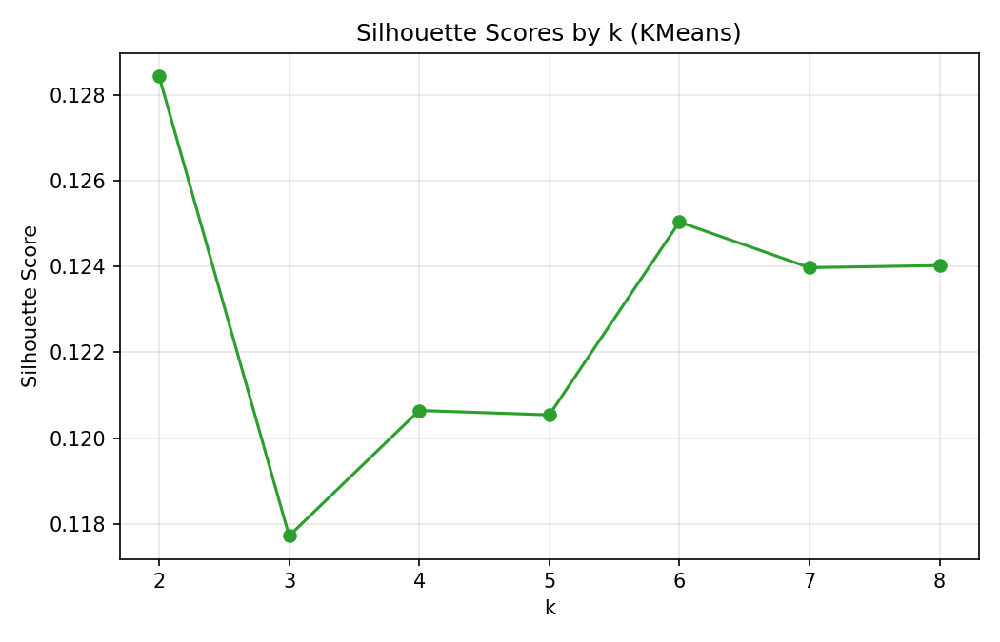
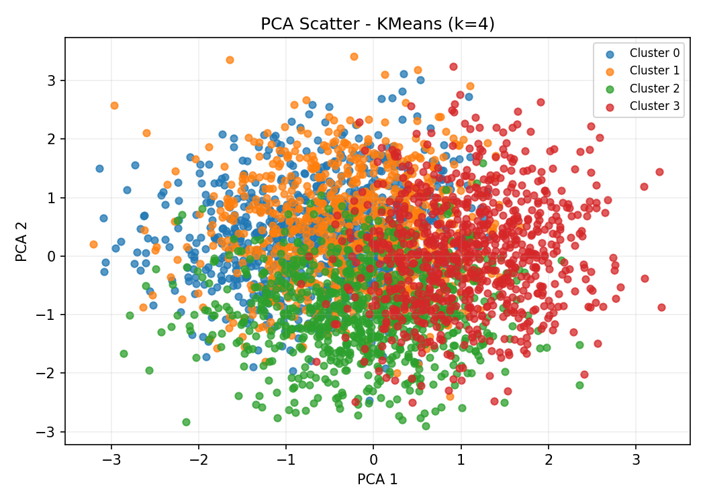
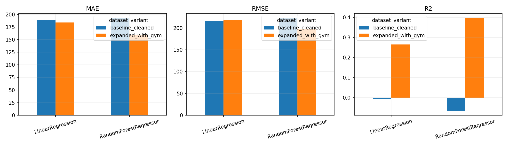
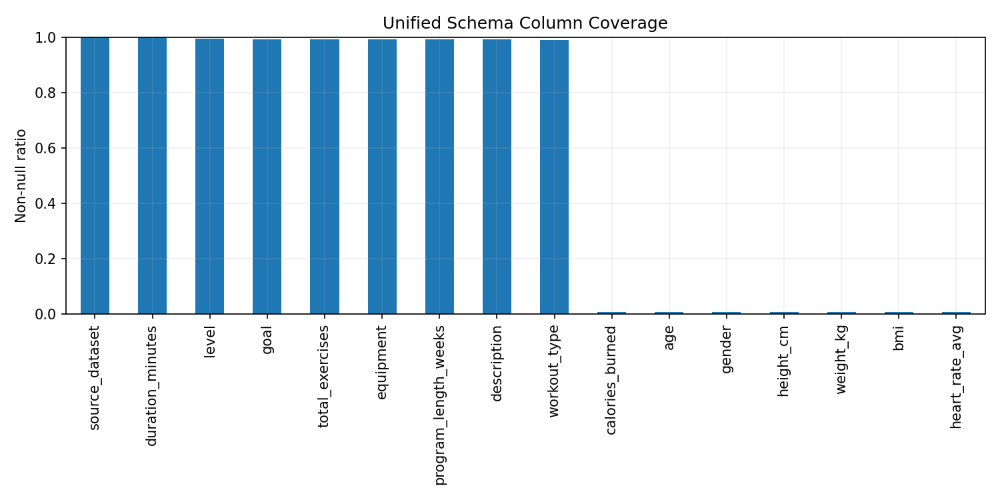

# 機器學習與實驗說明

本文件以目前專案中實際存在且可對照的程式、資料與實驗輸出為主，整理主系統使用的方法、模型表現、額外實驗，以及目前應誠實揭露的限制。

## 1. 主系統實際使用的方法

目前 Web 介面與主程式核心來自 `fitness_personalized_pipeline_v2.py`，整體不是單一模型，而是由多個模組組成的決策支援流程。

### 1.1 KMeans 分群
- 目的：將使用者的當日健康與活動狀態分到不同群組，作為生活型態解釋與建議定位。
- 使用特徵：
  - `age`
  - `bmi`
  - `steps`
  - `sleep_hours`
  - `heart_rate_avg`
  - `workout_duration_minutes`
- 前處理：`StandardScaler`
- 模型：`KMeans(n_clusters=4, random_state=42, n_init=10)`
- 系統角色：提供 `cluster_id`、群組均值摘要、分群解釋，不直接作為醫療診斷或長期人格分類。

### 1.2 RandomForestClassifier 活動等級分類
- 目的：預測使用者當日活動等級 `Low / Medium / High`。
- 使用特徵：
  - 數值特徵：`age, height_cm, weight_kg, steps, sleep_hours, heart_rate_avg, workout_duration_minutes, bmi`
  - 類別特徵：`gender, workout_type`
- 前處理：
  - 數值：`StandardScaler`
  - 類別：`OneHotEncoder(handle_unknown="ignore")`
- 模型：`RandomForestClassifier(n_estimators=250, min_samples_leaf=3, class_weight="balanced", random_state=42)`
- 系統角色：提供活動等級預測、重要特徵與文字解釋。

### 1.3 公式估算與 What-if 分析
- `estimate_goal_days()` 不是機器學習模型，而是以 BMR、TDEE、目標熱量差與保守增肌速率做達標時間估算。
- `what_if_analysis()` 會比較三種情境：
  - 每日步數 `+2000`
  - 運動時間 `+15 分鐘`
  - 睡眠時間 `+0.5 小時`
- 這兩個模組的重點是提供穩定、可解釋的決策依據，而不是追求純預測分數。

### 1.4 Weighted Scoring 課表推薦
- 目的：從課表資料中挑出最適合的 Top 3 課表。
- 主要評分因子：
  - `goal match`
  - `level match`
  - `equipment match`
  - `time match`
  - `program length fit`
- 方法性質：這不是監督式 ML 模型，而是規則式推薦方法。
- 採用原因：目前專案沒有足夠的真實使用者點擊、完成率或課表滿意度紀錄，因此以可解釋的規則方法較合理。

### 1.5 Cosine Similarity 飲食推薦
- 目的：把食物營養向量與目標營養向量做相似度比對，輸出 Top 5 食物。
- 使用欄位：
  - `Calories`
  - `Protein`
  - `Fat`
  - `Carbs`
- 方法性質：屬於相似度排序方法，不是訓練式預測模型。

### 1.6 Gemini 菜單生成
- 模型：`gemini-2.5-flash`
- 作用：根據目標熱量與推薦食物，生成一天菜單建議。
- 系統角色：生成式 AI 輔助輸出，屬於使用者體驗強化，不是核心數值模型。

## 2. 主系統模型表現

以下數值是依目前專案中的 `cleaned_fitness_data_v2.csv` 與現行程式重新執行得到，與目前系統版本一致。

### 2.1 KMeans 分群表現
- 分群數：`k = 4`
- 指標：`Silhouette score = 0.1206`

解讀：
- 此分數偏低，表示群與群之間存在明顯重疊。
- 因此分群結果較適合拿來做「群體描述與解釋」，不適合過度宣稱為高分離度分類結果。

圖 1. Elbow Method 用於比較不同 `k` 值下的群內誤差，作為 KMeans 分群數選擇的參考依據。

圖 2. Silhouette Scores 顯示不同 `k` 值的分群可分性，本專案最終採用 `k=4` 作為可解釋性與可用性的折衷設定。

圖 3. PCA 降維後的 KMeans `k=4` 分群視覺化結果，可觀察各群之間仍存在一定程度的重疊。

### 2.2 RandomForestClassifier 分類表現
- `Accuracy = 0.8842`
- `Macro Precision = 0.8848`
- `Macro Recall = 0.8838`
- `Macro F1 = 0.8842`

各類別 F1：
- `Low = 0.9011`
- `Medium = 0.8270`
- `High = 0.9244`

解讀：
- 整體分類表現穩定。
- `Medium` 類別相對較難判別，可能因為中等活動量本身就容易與低、高活動量樣本重疊。

### 2.3 為什麼不把回歸模型當主系統核心
- 主系統雖包含 `predict_calories_ml()`，但目前它只作為「ML 熱量預測參考」。
- 現行主流程沒有將回歸預測值直接拿來計算達標天數。
- 原因是達標估算若直接依賴不穩定預測值，誤差會被放大到整體建議流程中。

## 3. 額外實驗與補充結果

### 3.1 Dataset expansion 實驗

專案中另有 `experiments/dataset_expansion/`，主要用來比較是否加入額外資料集可改善熱量預測任務。

比較設定：
- Baseline：`cleaned_fitness_data_v2.csv`
- Expanded：Baseline 加上 `gym_members_exercise_tracking.csv` 後做 schema 對齊與合併
- 比較模型：
  - `LinearRegression`
  - `RandomForestRegressor`

本次比較結果如下：

| dataset variant | model | MAE | RMSE | R2 |
| --- | --- | ---: | ---: | ---: |
| baseline_cleaned | LinearRegression | 188.42 | 216.22 | -0.0094 |
| baseline_cleaned | RandomForestRegressor | 192.10 | 222.12 | -0.0652 |
| expanded_with_gym | LinearRegression | 183.79 | 218.56 | 0.2647 |
| expanded_with_gym | RandomForestRegressor | 158.69 | 198.15 | 0.3956 |

解讀：
- 在這次實驗中，`expanded_with_gym + RandomForestRegressor` 表現最佳。
- 但這仍屬額外實驗結果，不等於可直接無風險搬進主系統。
- 主要原因是跨資料來源整合可能帶來單位差異、量測條件差異與分佈偏移。

圖 4. 熱量預測模型比較圖，顯示 baseline 與 expanded dataset 在不同回歸模型下的表現差異。

圖 5. 資料欄位覆蓋比較圖，用來說明不同資料集在特徵完整度上的差異，支撐資料擴充實驗設計。

### 3.2 圖表與實驗輸出

本文件保留最能支撐主系統與補充實驗結論的關鍵圖表，避免列出過多未直接展示的圖片路徑，讓報告內容更精簡、可讀且適合提交。

## 4. 為什麼最終採用多模組決策支援

本專案沒有把所有事情都壓在單一模型上，原因如下：

### 4.1 問題本質不是單一預測
使用者真正需要的不只是「一個分數」，而是：
- 我現在屬於哪一種活動狀態？
- 我要優先改步數、睡眠還是運動時間？
- 哪一套課表最適合我？
- 飲食應該怎麼配合？

因此系統設計成：
- 分群負責定位
- 分類負責狀態判定
- 公式與 what-if 負責可執行策略
- 課表與飲食模組負責落地建議

### 4.2 各資料集粒度不同
- `cleaned_fitness_data_v2.csv` 是 `(user_id, date)` 層級，適合做當日狀態建模
- 課表資料是 program-level 或 exercise-level，適合推薦，不適合直接和 user-day 資料硬合併
- 飲食資料是 food-level，適合做營養相似度比對

因此不同資料集應負責不同模組，而不是全部硬整成一個大表。

## 5. 目前限制與誠實揭露

### 5.1 活動等級標籤不是外部人工標註
- `activity_level` 是由 `activity_score` 再依分位數切成 `Low / Medium / High`。
- 這表示分類模型學到的是「系統定義的活動分級規則」，不是醫療或專家人工標註真值。

### 5.2 分群可分性有限
- `Silhouette score = 0.1206` 顯示分群重疊度仍高。
- 因此 KMeans 較適合做描述與解釋，不宜過度宣稱絕對分類能力。

### 5.3 回歸結果仍有泛化風險
- 額外資料集加入後雖然改善了回歸指標，但跨資料來源的 domain shift 仍需留意。
- 因此回歸結果目前仍定位為補充實驗或輔助參考，而非主系統核心。

### 5.4 課表推薦是規則式方法
- 課表推薦沒有使用真實使用者互動紀錄做學習。
- 目前優點是可解釋、穩定、容易調整；缺點是缺少推薦系統常見的離線精度驗證或線上互動評估。

### 5.5 本系統偏向決策輔助，不是醫療判斷
- 系統可以提供方向性建議與可追溯理由。
- 但不應包裝成醫療診斷、專業處方或保證結果。

## 6. 一句話總結

本專案的核心不是追求單一模型最高分，而是在資料粒度不一致、標註有限的情況下，整合 `KMeans + RandomForestClassifier + 公式估算 + What-if + 課表推薦 + 飲食推薦 + LLM 菜單生成`，形成一套可解釋、可執行、可追溯的個人化健康決策支援流程。
