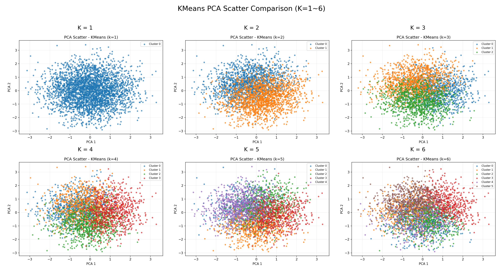
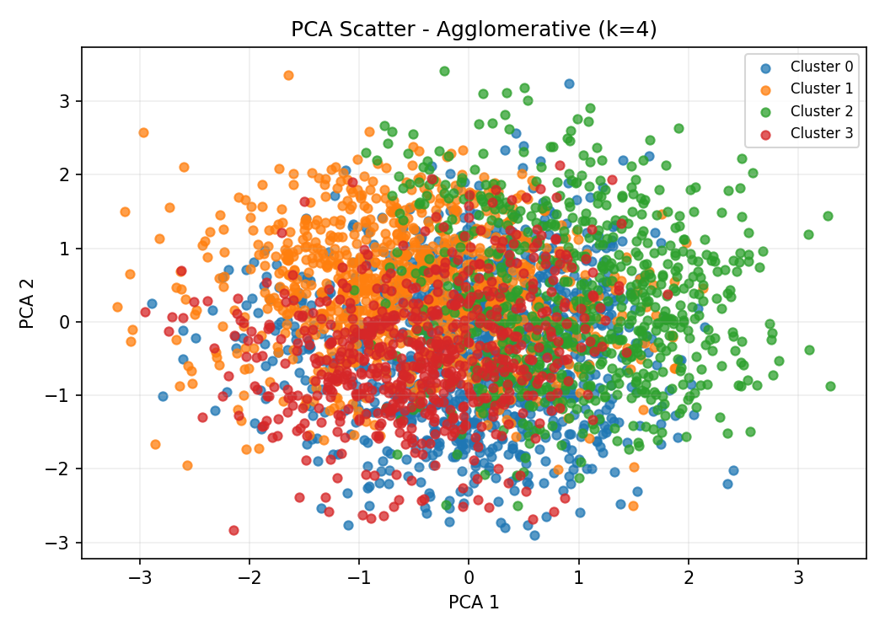
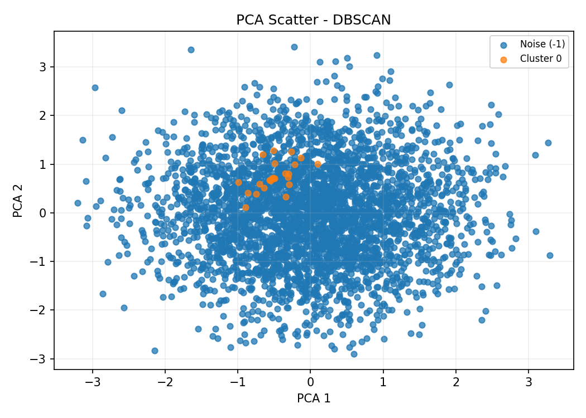
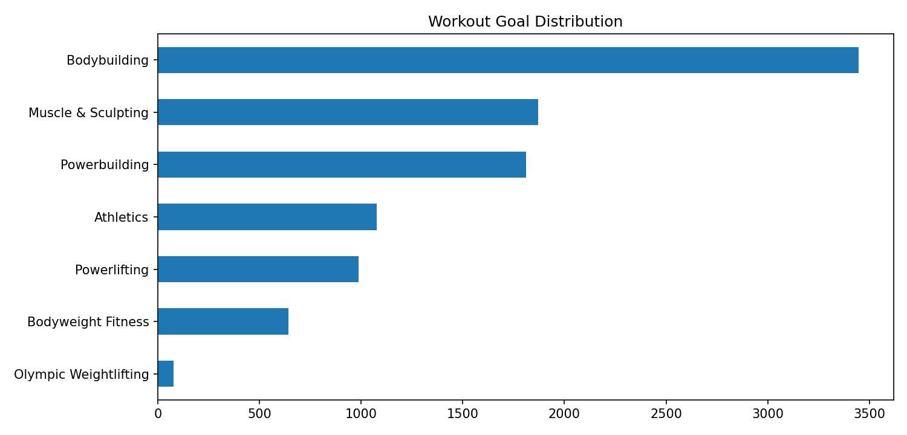
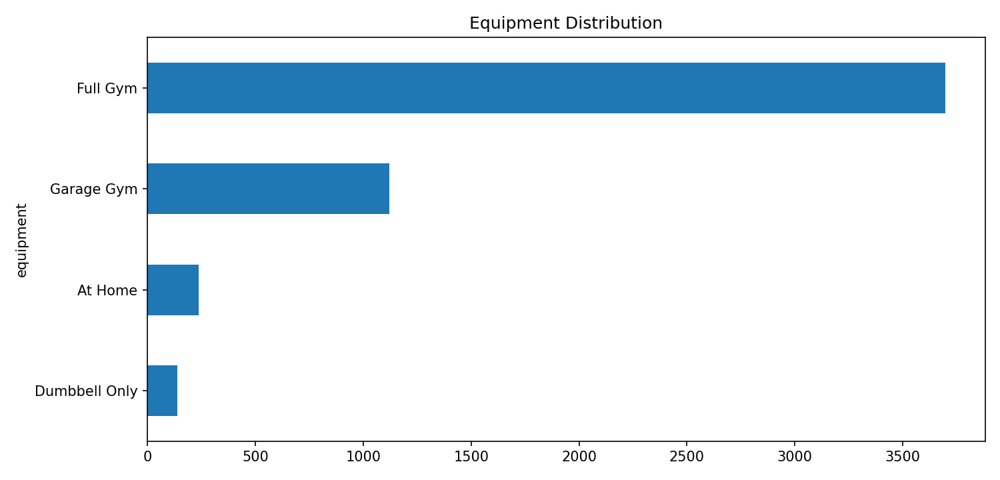

# 機器學習與實驗說明（以 `fitness_personalized_pipeline_v2.py` 為主）

本文件說明目前系統中各種 ML/推薦方法的角色、我們做過的實驗，以及為什麼最終採用「多模組決策支援」而不是單一預測模型。

---

## 1) 每個 ML 方法在幹嘛

## KMeans：當日活動狀態分群
- 目的：把使用者當日健康與活動狀態分到不同群組，提供情境定位與可解釋建議。
- 輸入特徵（v2）：`age, bmi, steps, sleep_hours, heart_rate_avg, workout_duration_minutes`
- 作用位置：`build_cluster_model()`
- 輸出：`cluster_id`、群組輪廓（平均步數/睡眠/心率/時長/BMI）、分群解釋文字。
- 解讀重點：較適合「當日活動狀態分群」，不是永久人格分類。
- 由於主資料集 granularity 為 `(user_id, date)`，因此此分群較適合解讀為：「當日活動狀態分群」，而非長期人格分類或永久生活型態分類。

## Random Forest：活動等級分類
- 目的：預測使用者當日活動等級（Low/Medium/High）。
- 輸入：數值特徵 + 類別特徵（gender/workout_type）
- 前處理：numeric scaler、categorical one-hot
- 作用位置：`build_activity_classifier()`
- 輸出：活動等級、重要特徵（feature importance）與判定解釋。

## Weighted Scoring：可解釋課表推薦方法（v2）
- 目的：從課表資料庫挑出最適合使用者當下目標與條件的 Top 3。
- 核心分數構成：goal match、level match、equipment match、time match、program length fit。
- 加權機制：會依 `goal_type`（減重/增肌）與活動程度偏好（Beginner/Intermediate）調整。
- 作用位置：`recommend_programs()`
- 輸出：中文課表名稱、原始 title、課表結構、推薦理由、限制、來源與可追溯筆數。
- Weighted Scoring 屬於推薦與決策規則方法（Recommendation / Decision Support）。
- 其核心為人工定義權重與規則計分：
  - goal match
  - level match
  - equipment match
  - time match
  - program length fit
- 因此它不是傳統監督式 Machine Learning 模型，而是一種可解釋、可追溯、易於調整的推薦策略。
- 選擇此方法的原因：目前缺乏大量真實使用者與課表互動紀錄，因此採用 Weighted Scoring 能在資料限制下提供穩定且可解釋的推薦結果。

## Cosine Similarity：飲食推薦
- 目的：將食物營養向量與目標營養向量比對，找出相似度最高食物。
- 模式選擇：以 `goal_type` 為主（`減重 -> fat_loss`、`增肌 -> muscle_gain`、其他 -> `balanced`）。
- 向量欄位：`Calories, Protein, Fat, Carbs`
- 作用位置：`recommend_foods()`
- 輸出：Top 5 食物、相似度分數與營養輔助解釋。

## Regression：熱量預測（補充實驗 / 輔助參考）
- 目的：估計單次運動熱量，作為報告中的參考對照。
- 地位：**不是主系統達標天數的核心**。
- 主系統仍以公式估算達標天數，避免把不穩定預測誤差直接傳遞到核心決策。
- 目前主系統不使用 Regression 預測結果計算達標天數。
- 達標天數仍以公式估算為主，避免將模型預測誤差直接傳遞至核心決策流程。
- Regression 輸出僅於最終報告中作為：「ML 熱量預測參考值」，供使用者比較公式估算與機器學習預測之差異。

---

## 2) 額外實驗總覽

## KMeans 的 K 值比較
- 實作檔：`clustering_experiment.py`
- 內容：比較 `k=2..8` 的 inertia 與 silhouette score。
- 輸出：
  - `outputs/clustering/elbow_method.png`
  - `outputs/clustering/silhouette_scores.png`
- 重點：`k=4` 是可用且易整合的設定，但不是唯一最優。

## PCA 分群圖
- 內容：將分群特徵降到 2D 視覺化。
- 輸出：
  - `outputs/clustering/pca_kmeans_k4.png`
  - 另有 `k=1~6` 比較圖與合併圖。
- 用途：幫助解釋群間重疊與分群可分性。

## silhouette score
- 計算方式：`silhouette_score(X_scaled, labels)`
- 現象：分數偏低（約 0.1x 等級），代表群界線存在重疊。
- 意義：分群可做「輔助解釋」，不應過度宣稱絕對分類能力。

## dataset expansion experiment
- 實作目錄：`experiments/dataset_expansion/`
- 內容：盤點資料、建立 unified schema、角色分析、模型比較、推薦範例。

![Level Distribution]experiments/dataset_expansion/outputs/level_distribution.png)

## calories prediction baseline vs expanded
- Baseline：`cleaned_fitness_data_v2.csv`
- Expanded：Baseline + `gym_members_exercise_tracking.csv`（schema 對齊後 concat）
- 比較模型：Linear Regression / RandomForestRegressor
- 指標：MAE, RMSE, R²
- 結果（該次實驗）：expanded 指標優於 baseline，但仍需注意跨資料來源的分佈差異與泛化風險。

## program recommendation v2
- 新增 `program_profiles.csv`（由 60 萬筆 exercise-level 彙整到 program-level）
- 新增 `program_profiles_zh.csv`（中文化與顯示名稱）
- 主流程優先讀 profile 資料，不直接掃原始巨量明細做即時推薦。

---

## 3) 最終為什麼這樣設計

## 為什麼不是全部資料硬合併
- 資料粒度不同：
  - fitness 主資料是 user-day（人-日）
  - detailed program 是 exercise-level（課表-週-日-動作）
- 若硬合併，會造成語意不一致、重複放大、模型偏誤與維運負擔。

## 為什麼不同資料集負責不同模組
- `cleaned_fitness_data_v2.csv`：最適合當日狀態建模（分群/分類/估算）
- `cleaned_nutrients_analysis.csv`：最適合營養向量比對
- `program_profiles_zh.csv`：最適合課表層級推薦與可解釋輸出
- `programs_detailed_boostcamp_kaggle.csv`：作為明細查詢庫，不直接進主推薦計算
- `gym_members_exercise_tracking.csv`：偏實驗驗證用途

## 為什麼主系統是 Decision Support，不是單純 Prediction
- 需求不是只要一個數字，而是要「可執行建議 + 原因 + 替代情境」。
- 系統需同時回答：
  - 我現在屬於哪類型？
  - 應該優先改哪件事？
  - 哪個課表比較適合？
  - 飲食怎麼配合？
- 因此採多模組輸出整合成決策報告，比單一預測更符合實際使用場景。

---

## 4) 目前限制與誠實評估

## 限制 1：分群可分性有限
- silhouette 偏低，表示群界線重疊。
- 分群較適合做「解釋與輔助」，不宜視為嚴格診斷分類。

## 限制 2：回歸任務仍有不確定性
- baseline R² 偏低，expanded 有改善但仍非高精度預測。
- 跨資料來源（不同收集條件）可能引入 domain shift。

## 限制 3：資料性質可能含 synthetic/清洗假設
- 若資料來源包含合成或強清洗邏輯，模型可能學到資料生成規則而非真實世界機制。

## 限制 4：課表欄位部分為規則推估
- `estimated_difficulty / split / major_muscles` 在 profile 中屬推估欄位。
- 適合決策輔助，不應包裝為醫療或專家處方結論。

## 限制 5：當日快照不是長期追蹤
- 主資料 granularity 為 `(user_id, date)`，重點是「當日狀態」。
- 對長期行為與因果推論能力有限。

---

## 5) 總結

本專案最終採用「分群 + 分類 + 公式估算 + what-if + 課表推薦 + 飲食推薦」的決策支援架構，不是追求單一模型分數，而是追求在資料限制下仍可解釋、可執行、可追溯的個人化建議流程。
